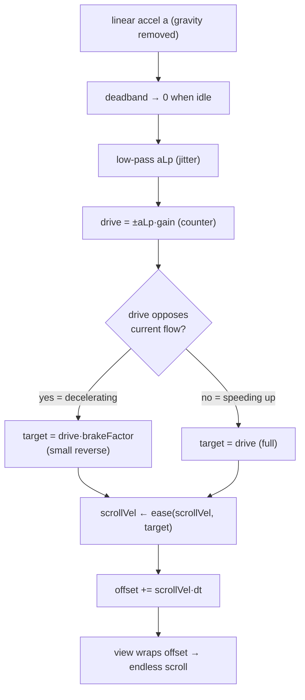

# Apple Vehicle Motion Cues — method, and Serene's flow overlay

How Apple's Vehicle Motion Cues (iOS 18 / iPadOS 18, "the anti-nausea dots")
work, the perceptual science behind them, and the model Serene ships in the v2
**Dynamic** overlay (`MotionFlowService.kt`).

> **Status:** current. v2 (`MotionFlowService`) is the shipped Dynamic style;
> v1 (`MotionOffsetService`, "Regular") is kept unchanged as a simpler option.
> The user picks between them; both run as system overlays on Android.

---

## 1. What Apple's dots do

- A field of dots sits around the screen **periphery** (edges), cueing
  peripheral vision without covering content.
- The dots **move opposite the vehicle's motion** — the direction inertia
  throws your body and loose objects:
  - **Accelerate forward** → dots sweep **backward** (down).
  - **Brake / decelerate** → dots sweep **forward** (up).
  - **Turn right** → dots sweep **left**; **turn left** → **right**.
- Driven by **accelerometer + gyroscope**.
- Dots **appear** when a moving vehicle is detected and **hide** when motion
  stops (Automatic mode). Styles: **Regular** (stable) and **Dynamic** (livelier).

Key fact: the dots are **in motion during accel/brake/turn and still during
steady cruising**. They express *movement*, not a parked offset.

---

## 2. The perceptual "why" — flow, not offset

Motion sickness is a **sensory conflict**: the vestibular system says "we're
moving," the eyes (on a phone) say "we're still."

1. **Otoliths sense *acceleration*** (specific force), semicircular canals sense
   *angular velocity*. The felt signal is strongest during **acceleration,
   braking, turns**, and ≈ 0 at constant velocity.
2. **Vision perceives *velocity* / optic flow** — the world streaming past. A
   *static offset* carries no flow; only *movement* of the field does.

So the field must **flow**, and flow **only when there is acceleration**. At
constant highway speed the otoliths are quiet, so a still scene is already
tolerated — flow there is just distraction.

> Research (Kaufeld et al., AutoUI '24; visual–vestibular reviews):
> **acceleration-based** optic-flow cues "mitigate motion sickness comparably to
> matched motion while causing fewer distractions." Acceleration-gated flow is
> the sweet spot.

This is why the mapping is **scroll velocity ∝ −acceleration**:

```
constant speed  → a = 0 → scroll velocity = 0 → dots still     ✅ quiet otoliths
accelerating    → a ≠ 0 → sustained backward flow              ✅ sustained push
braking         → a flips → forward flow                        ✅ sustained push
```

---

## 3. Serene's shipped model (`MotionFlowService`)

Per sensor sample (`dt` = seconds since the previous one), per axis:

```
a = deadband(rawAccel)                       // idle shimmer → 0
aLp += accLp · (a − aLp)                       // low-pass: strip hand jitter
drive = ±aLp · gain                            // counter-motion (X: −, Y: +)
reversing = drive·scrollVel < 0 && |scrollVel| > scrollEps
target = reversing ? drive·brakeFactor : drive // attenuate a stop's reverse
scrollVel += smooth · (target − scrollVel)     // ease
offset += scrollVel · dt                        // accumulate; view WRAPS it
```



### Why this shape

- **Scroll velocity, not position.** `offset` integrates a velocity, so
  sustained acceleration keeps the field scrolling (real optic flow), and it
  freezes when acceleration stops — matching the otoliths.
- **Memoryless brake, not a latch.** A hand "move and stop" is two acceleration
  pulses (push, then decel to stop); `∫a` over the whole move is ≈ 0, so a
  *symmetric* flow springs all the way back. The **brake** scales down only the
  drive that *opposes the current flow* (the deceleration), so most of the
  displacement stays and the spring-back is small. The test is a pure sign
  comparison (`drive·scrollVel < 0`) — **no state machine**, so it can never get
  stuck, and a fresh move from rest (`|scrollVel| ≈ 0`) is never braked.
- **`brakeFactor` is the spring knob.** `0` = freeze on stop (no reverse), `1` =
  full symmetric spring-back. Default `0.25` = a small, acceptable residual.
- **Wrapping field, no clamp.** `offset` never saturates; dots leave one edge and
  re-enter the other. There is no "wall" and no home position to spring toward.
- **Deadband + low-pass** keep the field still at rest and reject hand jitter
  without lagging the motion (we low-pass the *acceleration*, never a velocity —
  a velocity low-pass adds coasting inertia after a stop).

### Sign & axis convention

Dots move **opposite** the acceleration. The Android sensor's **Y points up**
while the **screen's Y points down**, so X is negated and Y is kept positive —
both end up countering on screen:

```
        ┌───────────────────────────────┐
        │              ↑ flow up          │   brake            → field flows UP
        │  ← flow left        flow right →│   turn right/left  → LEFT / RIGHT
        │              ↓ flow down         │   accelerate       → field flows DOWN
        └───────────────────────────────┘
            driveX = −aLpX·gain      driveY = +aLpY·gain
```

### Render

The field is a **staggered** (brick) grid confined to the **left/right edge
bands** by a smoothstep mask; the mask drives both dot radius and alpha, so dots
**breathe** in/out as they scroll rather than popping. Top/bottom middle stays
clear. Cell spacing scales with the density setting. Drawn in a single Canvas
window; each sample only mutates `offset` + a vsync-throttled repaint.

---

## 4. Tuning (no native rebuild)

Every constant lives in `FLOW_TUNING_DEFAULTS` (`constants/config.ts`) and is
sent to the service as JSON on each start. To tune:

```
1. edit flowTuningOverrides (or the defaults) in constants/config.ts
2. save → Fast Refresh
3. in the app: Stop → Start the overlay   (service re-reads the JSON)
```

Only the keys you set in `flowTuningOverrides` change; the rest fall back to the
defaults (`resolveFlowTuning` fills them with `??=`, and the native `Tuning`
falls back the same way via `optDouble`/`optInt`). The native `DEF_*` constants
mirror the JS defaults as a safety net if no JSON arrives.

| Key | Default | Effect |
|---|---|---|
| `gain` | 120 | scroll velocity (px/s) per m/s² — travel / speed |
| `brakeFactor` | 0.25 | **the spring**: 0 = none, 1 = full reverse |
| `accLp` | 0.2 | accel low-pass — higher = snappier, noisier |
| `deadband` | 0.12 | ignore \|accel\| below this (m/s²) |
| `smooth` | 0.2 | scroll-velocity easing — higher = snappier |
| `scrollEps` | 8 | scroll velocity (px/s) treated as "no active flow" |
| `maxDt` | 0.1 | per-sample dt clamp (s) — stall guard |
| `bandDp` | 24 | full-strength edge band width (dp) |
| `fadeDp` | 60 | fade-out ramp past the band (dp) |
| `fillAlpha` / `strokeAlpha` | 230 / 51 | dot fill / outline alpha (0–255) |

---

## 5. v1 (Regular) vs v2 (Dynamic)

| | v1 `MotionOffsetService` | v2 `MotionFlowService` |
|---|---|---|
| Mapping | `offset = −a·gain` (position) | `scrollVel = −a·gain`, `offset += scrollVel·dt` |
| Smoothing | EMA on position | ease on scroll velocity |
| Bounds | clamp ±40px | wrapping field (no wall) |
| Stop behavior | eases back to centre | small brake, mostly holds |
| Constant speed | displaced | still |
| Optic flow | ~none | yes |
| Layout | fixed peripheral dots | staggered scrolling edge bands |
| Tunable from JS | no | yes (all constants) |

Both share: `LINEAR_ACCELERATION` sensor, counter-motion sign, native
single-window Canvas + vsync repaint, and the size/density/opacity/sensitivity
settings.

### A note on hand-testing

Testing on a desk (quick shake-and-stop) is the pathological case: the push and
the stop are a fraction of a second apart, so the deceleration is a visible cue.
In a vehicle, accel and brake are seconds apart, so the flow reads cleanly. The
`brakeFactor` exists mainly to keep the desk test from looking springy; it costs
nothing in the car.

---

## 6. Sources

- Apple Support — *Use iPhone more comfortably while riding in a vehicle*
  (dots move opposite vehicle motion; Automatic show/hide; Regular vs Dynamic).
- Macworld / MacRumors / Mac Observer — behavior (accelerometer + gyroscope;
  dots at edges; left on right-turn, forward on brake).
- Kaufeld et al., *Acceleration instead of Speed: Acceleration Visual Cues in VR
  for Reduced Motion Sickness in Linear Motion*, AutoUI '24
  (`10.1145/3641308.3685023`) — acceleration-based optic-flow cues reduce
  sickness with fewer distractions; starfield moves backward on acceleration,
  ceases at steady speed, forward on braking.
- *Acceleration or velocity? Exploring minimally disruptive visual motion cues
  for reducing motion sickness in passenger VR*, ScienceDirect
  (`S0003687026000566`).
- Visual–vestibular integration reviews (Springer *Exp Brain Res* 2023; PMC
  self-motion perception) — otoliths sense acceleration, vision senses
  velocity/optic flow; omit cues at constant velocity.
- Apple patents: US 11,321,923 (*Immersive display of motion-synchronized
  virtual content*), US 10,825,255 / 10,482,669 (*Augmented virtual display*).

---

## Related

- `docs/motion-cues-pipeline.md` — the v1 accelerometer→dot pipeline.
