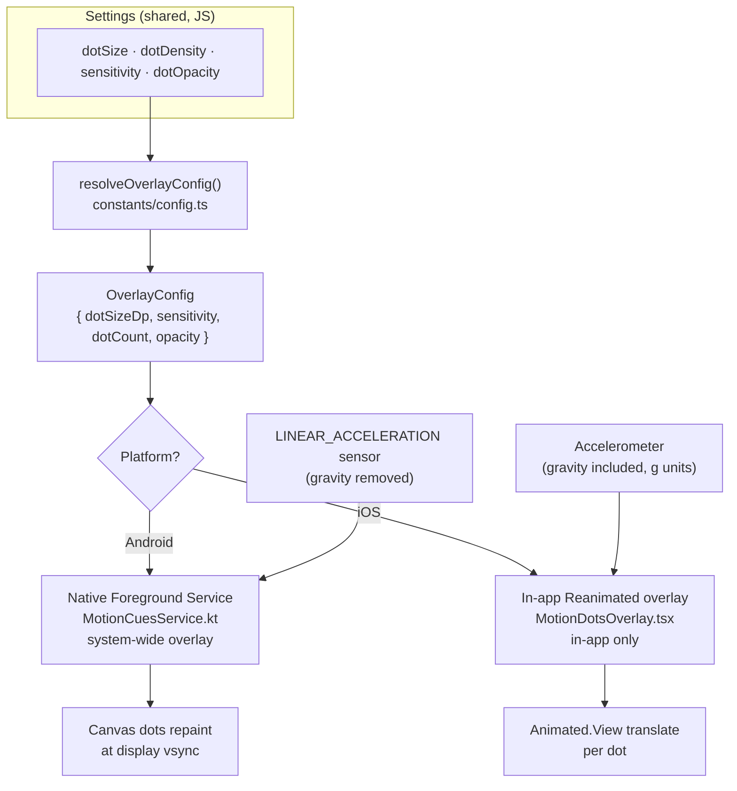
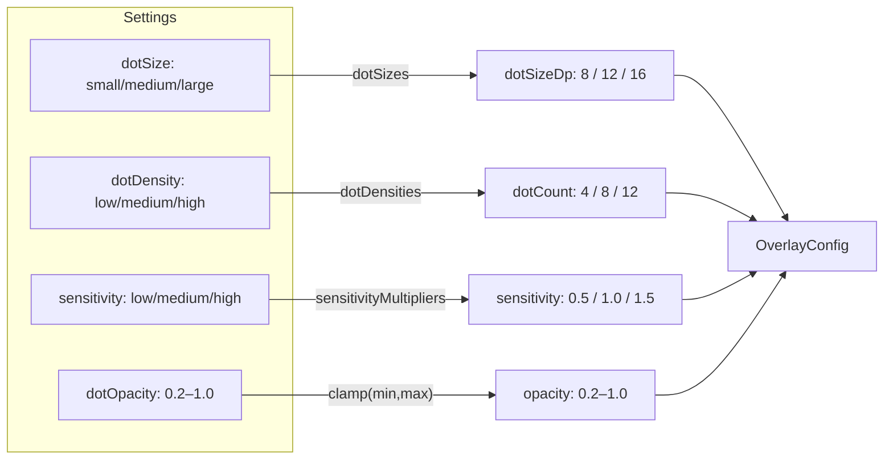
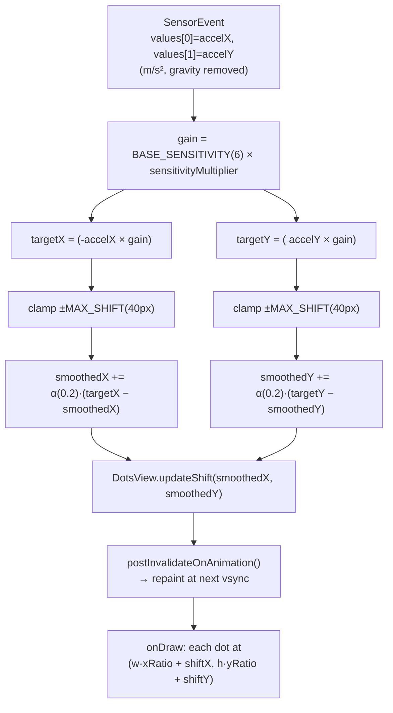
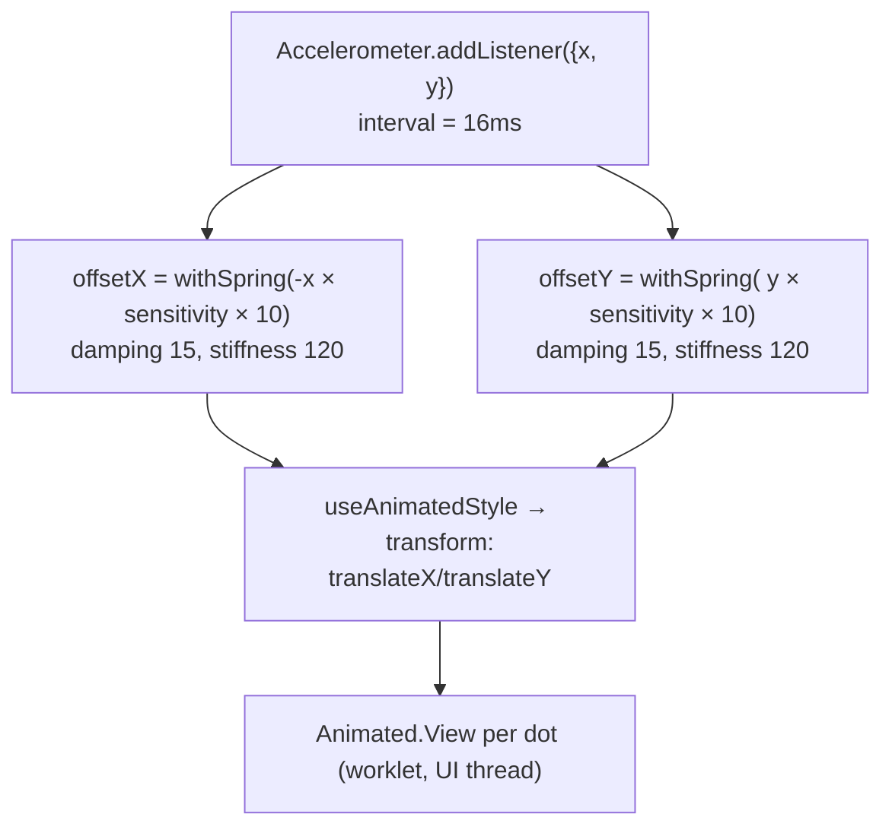

# Motion Cues — Accelerometer → Dot Motion Pipeline

How Serene turns raw device acceleration into the peripheral dots that move
with a vehicle. This documents the **core signal path**: sensor sample →
gain → clamp → smoothing → dot offset → render.

The goal (Nagoya University, 2025): give peripheral vision a cue that agrees
with the vestibular system, reducing the sensory conflict that causes motion
sickness. A car turns right → the dots slide left, matching what the inner
ear feels.

---

## 1. High-level flow



The **config resolution** is platform-agnostic and pure; only the **render +
smoothing** differ per platform because Apple forbids third-party system
overlays (iOS is in-app only).

---

## 2. Shared config resolution

`resolveOverlayConfig` is the single source of truth mapping user-facing
presets to concrete numbers. Pure function, unit-tested.



| Setting | Values | Resolves to | Consumed by |
|---|---|---|---|
| `dotSize` | small / medium / large | `8 / 12 / 16` dp | dot radius |
| `dotDensity` | low / medium / high | `4 / 8 / 12` dots | position count |
| `sensitivity` | low / medium / high | `0.5 / 1.0 / 1.5` × | gain multiplier |
| `dotOpacity` | slider 0.2–1.0 | clamped 0.2–1.0 | window/dot alpha |

---

## 3. Android core loop (primary path)

The native service registers for `TYPE_LINEAR_ACCELERATION` at
`SENSOR_DELAY_GAME`. Each sample runs this pipeline in `onSensorChanged`:



### Why each stage exists

| Stage | Purpose |
|---|---|
| **Negate X** | Car turns right (+X) → dots shift **left**, matching the vestibular cue (Apple's convention). |
| **× gain** | Converts m/s² into pixels; user sensitivity scales it. |
| **clamp ±40px** | Bounds travel so dots stay in the peripheral frame, never fly off. |
| **EMA low-pass (α=0.2)** | The fix for hard-shake jitter. Sustained motion (braking, turning) is tracked; high-frequency shake spikes are averaged toward zero instead of snapping to the clamp. ~100 ms time constant at `SENSOR_DELAY_GAME`. |
| **vsync repaint** | Only the shift fields mutate + a vsync-throttled invalidate — no per-frame `WindowManager` traffic, so other apps aren't starved. |

### EMA intuition

```
smoothed ← smoothed + α · (target − smoothed)     α = 0.2

A single spike moves the output only 20% of the way, so a 1-frame
shake barely registers; a sustained lean converges over ~5 frames.

target  ▁▁▇▁▁▁▇▁▁   (raw: shake spikes)
smoothed ▁▁▂▁▁▁▂▁▁   (damped: dots stay calm)

target  ▁▂▄▆▇▇▇▇▇   (raw: sustained turn)
smoothed ▁▁▂▃▅▆▇▇▇   (tracked: dots follow, slight lag)
```

---

## 4. Android lifecycle & state sync

The overlay is a foreground service that must (a) die with the app and (b)
keep the JS on/off toggle honest.

```mermaid
sequenceDiagram
    participant UI as Settings/Control (JS)
    participant Hook as useMotionCues
    participant Bridge as MotionCuesModule
    participant Svc as MotionCuesService (native)

    UI->>Hook: startOverlay()
    Hook->>Bridge: startOverlay(config, localizedNotif)
    Bridge->>Svc: startForegroundService(intent + extras)
    Svc->>Svc: read extras → config fields
    Svc->>Svc: teardown() → setupOverlay()
    alt window attached
        Svc->>Svc: startSensor(); isRunning = true
    else permission revoked
        Svc->>Svc: Log.w; isRunning = false; stopSelf()
    end

    Note over UI,Svc: user changes a setting while active
    UI->>Hook: settings change
    Hook->>Bridge: startOverlay(newConfig) (auto-restart)
    Bridge->>Svc: fresh intent → rebuild with new look

    Note over UI,Svc: user swipes app from Recents
    Svc->>Svc: onTaskRemoved → stopSelf() (dots vanish)

    Note over UI,Svc: user reopens app
    UI->>Hook: AppState → active
    Hook->>Bridge: isOverlayActive()
    Bridge-->>Hook: MotionCuesService.isRunning
    Hook->>UI: setIsActive(real state)  %% no stale "off"
```

Key guarantees:
- **`START_NOT_STICKY`** — the system never silently resurrects the overlay; JS owns on/off.
- **`isRunning` reflects reality** — only set true if `addView` actually attached, so `isOverlayActive()` can't lie (no phantom "active" while nothing is drawn).
- **State resync on foreground** — `check()` re-reads the real service state, guarded against out-of-order async resolution.

---

## 5. iOS core loop (in-app only)

Apple blocks system overlays, so iOS renders the dots **inside the app**
using `expo-sensors` + Reanimated. Note it reads the raw **Accelerometer**
(gravity included, g units) rather than linear acceleration, and smooths with
a **spring** instead of an EMA.



The spring's `damping`/`stiffness` play the same role the EMA does on
Android — physically-bounded smoothing that follows sustained motion and
absorbs jitter.

---

## 6. Axis & sign convention

```
                      screen
        ┌───────────────────────────────┐
        │   •            ↑ −Y            •│   accelY > 0  (accelerate/brake fwd)
        │              dots shift        │      → dots shift DOWN (+Y screen)
        │  •     ← −X   center   +X →   •│
        │              dots shift        │   accelX > 0  (turn right)
        │   •            ↓ +Y            •│      → dots shift LEFT (−X screen)
        └───────────────────────────────┘
              negate X: shiftX = −accelX·gain
              keep   Y: shiftY = +accelY·gain
```

The negation on X is what makes the cue *counter* the motion (vestibular
match); Y is kept positive so forward acceleration pushes dots down.

---

## 7. Constants reference

| Constant | Value | Where | Role |
|---|---|---|---|
| `BASE_SENSITIVITY` | `6f` | Service (native) | base px gain per m/s² |
| `MAX_SHIFT` | `40f` | Service (native) | max dot travel (px) |
| `LOW_PASS_ALPHA` | `0.2f` | Service (native) | EMA weight (~100 ms) |
| `MIN_OPACITY` | `0.2f` | Service (native) | alpha floor (dots stay visible) |
| sensor rate | `SENSOR_DELAY_GAME` | Service (native) | ~50 Hz sampling |
| `sensorUpdateInterval` | `16` ms | config.ts | iOS accelerometer rate (~60 Hz) |
| spring | `damping 15, stiffness 120` | iOS overlay | iOS smoothing |
| iOS gain | `× 10` | iOS overlay | g → px scale |

---

## 8. Android vs iOS at a glance

| | Android | iOS |
|---|---|---|
| Sensor | `LINEAR_ACCELERATION` (gravity removed) | `Accelerometer` (gravity included) |
| Scope | System-wide overlay (foreground service) | In-app only |
| Render | Native `Canvas` (single window) | Reanimated `Animated.View` per dot |
| Smoothing | EMA low-pass (α = 0.2) | `withSpring` (damping/stiffness) |
| Clamp | explicit ±40 px | implicit (spring bounds) |
| Density honored | ✅ 4 / 8 / 12 | ⚠️ fixed 8 (see roadmap) |
| Size / sensitivity / opacity | ✅ | ✅ |

---

## Source map

| Concern | File |
|---|---|
| Config + resolver | `constants/config.ts` |
| Settings state | `hooks/useSettings.tsx` |
| Lifecycle + state sync | `hooks/useMotionCues.ts` |
| JS bridge | `modules/MotionCuesModule.ts` |
| Native bridge | `plugins/motion-cues-native/java/MotionCuesModule.kt` |
| Native service (core loop) | `plugins/motion-cues-native/java/MotionCuesService.kt` |
| iOS overlay | `components/MotionDotsOverlay.tsx` |
